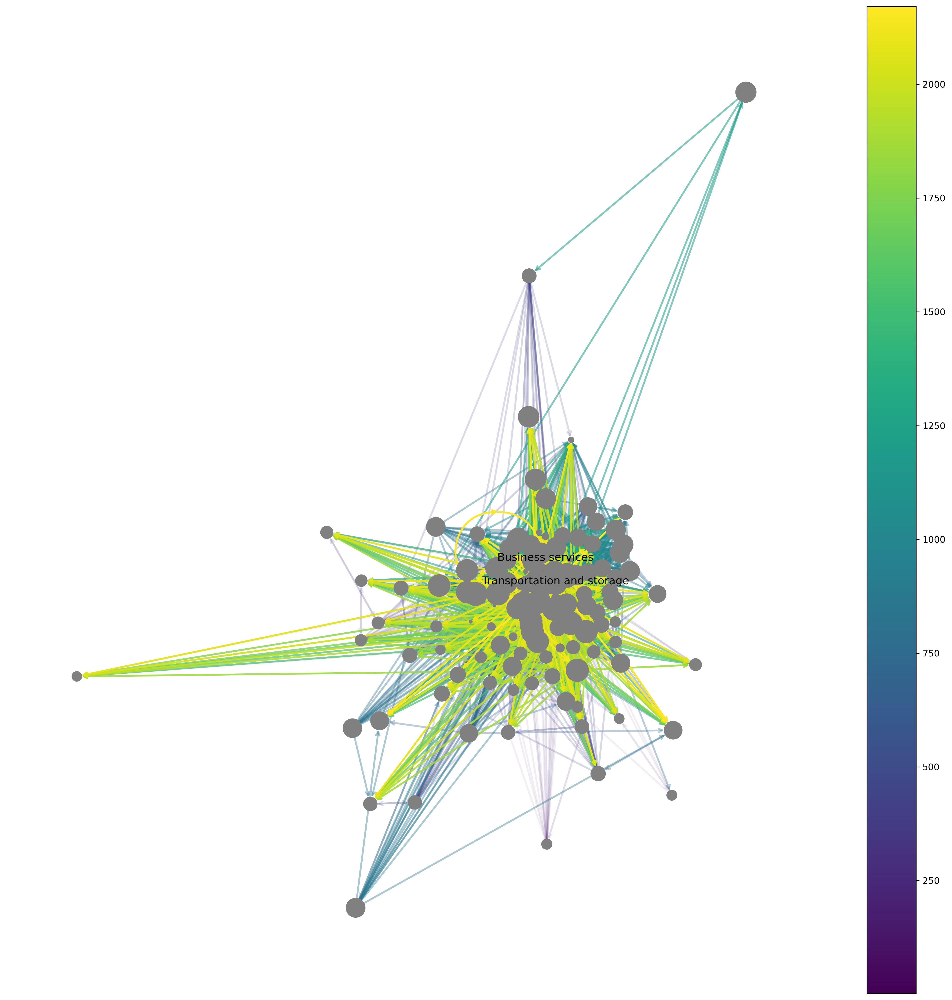
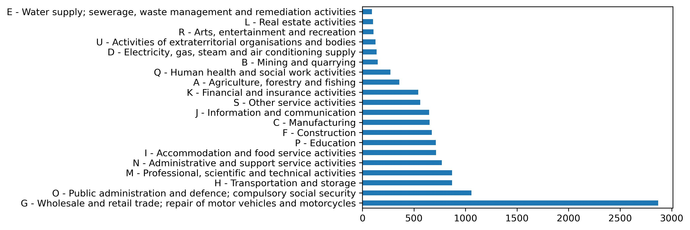
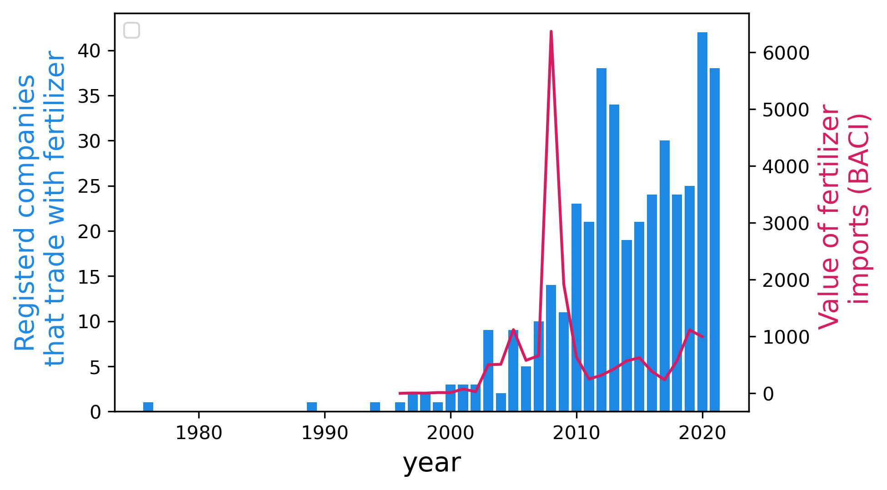

<head>
    <link rel="stylesheet" href="../styles.css">
</head>

# Sentiment analysis of the mission statements

To gain individual level insights into the Mozambican economy, I apply a a class-based TF-IDF procedure ([BERTtopic](https://arxiv.org/abs/2203.05794)) to cluster word embeddings from the mission statements in the BDR3, i.e. the same publication that I use in the first two chapters to observe the ownership structure of Mozambican firms. Below are two dimensional topic representations of the tree most common entry types registered in the BDR3. I auto-translated the mission statements from portugese to english before I applied the sentiment analysis. 

 

 Associations (associacao) 

 
 <iframe src= "../assets/bert_topics/intertopic_distance/associacao_topic.html" width="95%" height="500px"></iframe>

 

 Individual company (sociedade individual) 

 
<iframe src="../assets/bert_topics/intertopic_distance/sociedade_individual_topic.html" width="100%" height="600px"></iframe>

 

 Private limited company (sociedade por quotas) 

 
<iframe src="../assets/bert_topics/intertopic_distance/sociedade_por_quotas_topic.html" width="100%" height="600px"></iframe>

# Example: Social associations over time
To illustrate how topic modeling provides unique insights into the mozambican society. Let's consider the question which type of social entities benefited from the rapid economic growth in Mozambique after 2009.

# Mapping the Mozambican economy

Every society needs data to study and plan the allocation of its resource. This is a crucial constrain for many low income countries is notorious difficult, as public accounts do not have capacity to provide the necessary data. 
This section outlines for the case of Mozambique, how the use of Natural Language Processing (NLP) and Large Language Models can be used to solve this lack of useful data.

Here we lok at the combination of two data sets. First the entries from the **Bulletin of the Republic of Mozambique** (Boletim da Republica de Moçambique), an official publication of the Mozambican government that documents firm registrations. Second, the trade statistics from the United Nations Commodity Trade Statistics Database (UN Comtrade). To be specific, we use **BACI** a cleaner version of the UN Comtrade data set.

To illustrate the potential of this data and the potential of NLP, we will start with two simple questions: **1) Where can one buy fertalizer in Mozambique?** and  **2) Which supply chains use fertalizer?**

## Existing measures 

With existing data, we could answer this question via the 2015 Social Accounting Matrix [(SAM)](https://www.wider.unu.edu/database/2015-social-accounting-matrix-mozambique) of Mozambique, composed by the United Nations University World Institute for Development Economics Research (UNU-WIDER). The  **SAM is a static macro overview** that provides a detailed representation of the Mozambican economy and separates 55 activities and commodities in 2015. One of these activities is fertilizer, the figure below shows the network graph of financial flows in (in million Meticals) between each activities and commodities. If we want to know where to buy fertilizer, we would to look at the firm level data, which is not available in the SAM.
o

## Trade and administrative data complement each other

Let's take a look how trade statistics and administrative records can answer this question.
The figure below shows the imports of fertilizer and numbers of annually registered companies that trade with fertilizer in Mozambique between 1985 and 2021. To determine whether a company operates in this business, I apply NLP for a sentiment analysis of a each companies mission statement. 
 

The figure shows that fertilizer imports skyrocketed in 2008, while the number of domestic companies that trade with fertilizer remained relatively stable before 2010. After 2010, the number of companies that trade with fertilizer increased, but the imports of fertilizer decreased to the initial import level. 

 We can now look at the location of the xxx firms that operate in total in the fertilizer business. The figure below shows the location of these firms in Mozambique. The figure shows that the majority of firms are located in the capital Maputo, but there are also firms in the north of the country.

[insert map of fertilizer firms]

[mention the failure of the Zambezi Valley project

